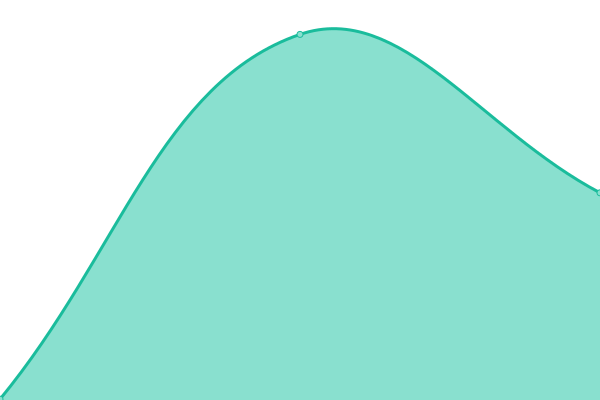
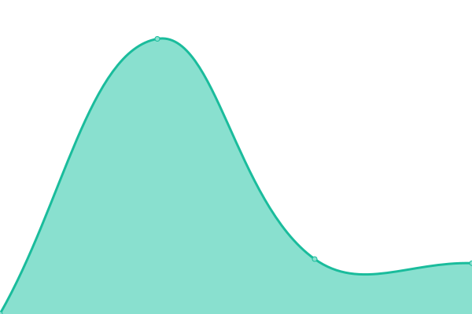
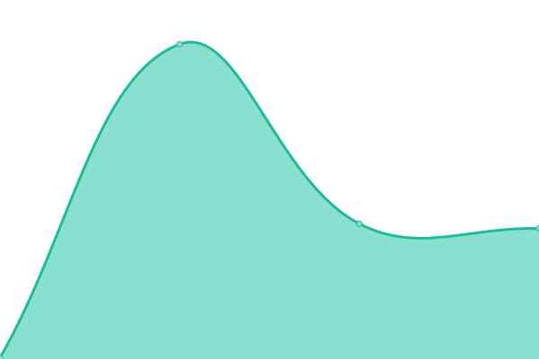

# [📈 Live Status](https://demo.upptime.js.org): <!--live status--> **🟩 All systems operational**

This repository contains the open-source uptime monitor and status page for [Cutiei](https://demo.upptime.js.org), powered by [Upptime](https://github.com/upptime/upptime).

With [Upptime](https://upptime.js.org), you can get your own unlimited and free uptime monitor and status page, powered entirely by a GitHub repository. We use [Issues](https://github.com/Cutiei/Uptime/issues) as incident reports, [Actions](https://github.com/Cutiei/Uptime/actions) as uptime monitors, and [Pages](https://demo.upptime.js.org) for the status page.

<!--start: status pages-->
<!-- This summary is generated by Upptime (https://github.com/upptime/upptime) -->
<!-- Do not edit this manually, your changes will be overwritten -->
<!-- prettier-ignore -->
| URL | Status | History | Response Time | Uptime |
| --- | ------ | ------- | ------------- | ------ |
|  [Google](https://www.google.com) | 🟩 Up | [google.yml](https://github.com/Cutiei/Uptime/commits/HEAD/history/google.yml) | 

 137ms
     
 | 

<a href="https://Cutiei.github.io/Uptime/history/google">100.00%</a>
    

|  [nav.5i.gs](https://nav.5i.gs) | 🟩 Up | [nav-5i-gs.yml](https://github.com/Cutiei/Uptime/commits/HEAD/history/nav-5i-gs.yml) | 

 189ms
     
 | 

<a href="https://Cutiei.github.io/Uptime/history/nav-5i-gs">100.00%</a>
    

|  [104.128.189.11](http://104.128.189.11/) | 🟩 Up | [104-128-189-11.yml](https://github.com/Cutiei/Uptime/commits/HEAD/history/104-128-189-11.yml) | 

 72ms
     
 | 

<a href="https://Cutiei.github.io/Uptime/history/104-128-189-11">100.00%</a>
    

|  [89.117.94.99](http://89.117.94.99/) | 🟩 Up | [89-117-94-99.yml](https://github.com/Cutiei/Uptime/commits/HEAD/history/89-117-94-99.yml) | 

 1876ms
     
 | 

<a href="https://Cutiei.github.io/Uptime/history/89-117-94-99">100.00%</a>
    

|  [173.249.203.183](http://173.249.203.183/) | 🟩 Up | [173-249-203-183.yml](https://github.com/Cutiei/Uptime/commits/HEAD/history/173-249-203-183.yml) | 

 77ms
     
 | 

<a href="https://Cutiei.github.io/Uptime/history/173-249-203-183">100.00%</a>
    

|  [http://88.99.163.99:51968/](http://88.99.163.99:51968/) | 🟩 Up | [http-88-99-163-99-51968.yml](https://github.com/Cutiei/Uptime/commits/HEAD/history/http-88-99-163-99-51968.yml) | 

 358ms
     
 | 

<a href="https://Cutiei.github.io/Uptime/history/http-88-99-163-99-51968">100.00%</a>
    

|  [http://88.99.163.99:51969/](http://88.99.163.99:51969/) | 🟩 Up | [http-88-99-163-99-51969.yml](https://github.com/Cutiei/Uptime/commits/HEAD/history/http-88-99-163-99-51969.yml) | 

 647ms
     
 | 

<a href="https://Cutiei.github.io/Uptime/history/http-88-99-163-99-51969">100.00%</a>
    

|  [http://89.117.94.99:51002/](http://89.117.94.99:51002/) | 🟩 Up | [http-89-117-94-99-51002.yml](https://github.com/Cutiei/Uptime/commits/HEAD/history/http-89-117-94-99-51002.yml) | 

 143ms
     
 | 

<a href="https://Cutiei.github.io/Uptime/history/http-89-117-94-99-51002">100.00%</a>
    

|  [http://104.128.189.11:40076/](http://104.128.189.11:40076/) | 🟩 Up | [http-104-128-189-11-40076.yml](https://github.com/Cutiei/Uptime/commits/HEAD/history/http-104-128-189-11-40076.yml) | 

 91ms
     
 | 

<a href="https://Cutiei.github.io/Uptime/history/http-104-128-189-11-40076">100.00%</a>
    

|  [https://sslms.h-e.top/](https://sslms.h-e.top/) | 🟩 Up | [https-sslms-h-e-top.yml](https://github.com/Cutiei/Uptime/commits/HEAD/history/https-sslms-h-e-top.yml) | 

 389ms
     
 | 

<a href="https://Cutiei.github.io/Uptime/history/https-sslms-h-e-top">100.00%</a>
    

|  [http://173.249.203.183:59200/](http://173.249.203.183:59200/) | 🟩 Up | [http-173-249-203-183-59200.yml](https://github.com/Cutiei/Uptime/commits/HEAD/history/http-173-249-203-183-59200.yml) | 

 79ms
     
 | 

<a href="https://Cutiei.github.io/Uptime/history/http-173-249-203-183-59200">100.00%</a>
    

|  [http://173.249.203.183:55232/](http://173.249.203.183:55232/) | 🟩 Up | [http-173-249-203-183-55232.yml](https://github.com/Cutiei/Uptime/commits/HEAD/history/http-173-249-203-183-55232.yml) | 

 219ms
     
 | 

<a href="https://Cutiei.github.io/Uptime/history/http-173-249-203-183-55232">100.00%</a>
    

|  [H-e.top](https://h-e.top/) | 🟩 Up | [h-e-top.yml](https://github.com/Cutiei/Uptime/commits/HEAD/history/h-e-top.yml) | 

 362ms
     
 | 

<a href="https://Cutiei.github.io/Uptime/history/h-e-top">100.00%</a>
    

|  [So.h-e.top](https://so.h-e.top/) | 🟩 Up | [so-h-e-top.yml](https://github.com/Cutiei/Uptime/commits/HEAD/history/so-h-e-top.yml) | 

 466ms
     
 | 

<a href="https://Cutiei.github.io/Uptime/history/so-h-e-top">100.00%</a>
    

|  [Www.ycasyy.cn](https://www.ycasyy.cn/) | 🟩 Up | [www-ycasyy-cn.yml](https://github.com/Cutiei/Uptime/commits/HEAD/history/www-ycasyy-cn.yml) | 

 388ms
     
 | 

<a href="https://Cutiei.github.io/Uptime/history/www-ycasyy-cn">100.00%</a>
    

|  [Happy.ez6swh.cn](https://happy.ez6swh.cn/) | 🟩 Up | [happy-ez6swh-cn.yml](https://github.com/Cutiei/Uptime/commits/HEAD/history/happy-ez6swh-cn.yml) | 

 427ms
     
 | 

<a href="https://Cutiei.github.io/Uptime/history/happy-ez6swh-cn">100.00%</a>
    

|  [Inewsi.cn](https://inewsi.cn/) | 🟩 Up | [inewsi-cn.yml](https://github.com/Cutiei/Uptime/commits/HEAD/history/inewsi-cn.yml) | 

 256ms
     
 | 

<a href="https://Cutiei.github.io/Uptime/history/inewsi-cn">100.00%</a>
    

|  [Play.h-e.top](https://play.h-e.top/) | 🟩 Up | [play-h-e-top.yml](https://github.com/Cutiei/Uptime/commits/HEAD/history/play-h-e-top.yml) | 

 359ms
     
 | 

<a href="https://Cutiei.github.io/Uptime/history/play-h-e-top">100.00%</a>
    

|  [Drawio.h-e.top](https://drawio.h-e.top/) | 🟩 Up | [drawio-h-e-top.yml](https://github.com/Cutiei/Uptime/commits/HEAD/history/drawio-h-e-top.yml) | 

 401ms
     
 | 

<a href="https://Cutiei.github.io/Uptime/history/drawio-h-e-top">100.00%</a>
    

|  [Api.h-e.top](https://api.h-e.top/) | 🟩 Up | [api-h-e-top.yml](https://github.com/Cutiei/Uptime/commits/HEAD/history/api-h-e-top.yml) | 

 458ms
     
 | 

<a href="https://Cutiei.github.io/Uptime/history/api-h-e-top">100.00%</a>
    

|  [Mc.2b2t.cyou](https://mc.2b2t.cyou/) | 🟩 Up | [mc-2b2t-cyou.yml](https://github.com/Cutiei/Uptime/commits/HEAD/history/mc-2b2t-cyou.yml) | 

 314ms
     
 | 

<a href="https://Cutiei.github.io/Uptime/history/mc-2b2t-cyou">100.00%</a>
    

|  [mat.5i.gs](https://mat.5i.gs/) | 🟩 Up | [mat-5i-gs.yml](https://github.com/Cutiei/Uptime/commits/HEAD/history/mat-5i-gs.yml) | 

 916ms
     
 | 

<a href="https://Cutiei.github.io/Uptime/history/mat-5i-gs">100.00%</a>
    

|  [s.5i.gs](https://s.5i.gs/) | 🟩 Up | [s-5i-gs.yml](https://github.com/Cutiei/Uptime/commits/HEAD/history/s-5i-gs.yml) | 

 248ms
     
 | 

<a href="https://Cutiei.github.io/Uptime/history/s-5i-gs">100.00%</a>
    

|  [iviaja.com](https://iviaja.com/) | 🟩 Up | [iviaja-com.yml](https://github.com/Cutiei/Uptime/commits/HEAD/history/iviaja-com.yml) | 

 1378ms
     
 | 

<a href="https://Cutiei.github.io/Uptime/history/iviaja-com">100.00%</a>
    

|  [uptime.5i.gs](https://uptime.5i.gs/) | 🟩 Up | [uptime-5i-gs.yml](https://github.com/Cutiei/Uptime/commits/HEAD/history/uptime-5i-gs.yml) | 

 1888ms
     
 | 

<a href="https://Cutiei.github.io/Uptime/history/uptime-5i-gs">100.00%</a>
    

|  [rss.5i.gs](https://rss.5i.gs/) | 🟩 Up | [rss-5i-gs.yml](https://github.com/Cutiei/Uptime/commits/HEAD/history/rss-5i-gs.yml) | 

 162ms
     
 | 

<a href="https://Cutiei.github.io/Uptime/history/rss-5i-gs">100.00%</a>
    

|  [nav.5i.gs](https://nav.5i.gs) | 🟩 Up | [nav-5i-gs.yml](https://github.com/Cutiei/Uptime/commits/HEAD/history/nav-5i-gs.yml) | 

 189ms
     
 | 

<a href="https://Cutiei.github.io/Uptime/history/nav-5i-gs">100.00%</a>
    

|  [git.5i.gs](https://git.5i.gs/) | 🟩 Up | [git-5i-gs.yml](https://github.com/Cutiei/Uptime/commits/HEAD/history/git-5i-gs.yml) | 

 180ms
     
 | 

<a href="https://Cutiei.github.io/Uptime/history/git-5i-gs">100.00%</a>
    

|  [alist.h-e.top](https://alist.h-e.top/) | 🟩 Up | [alist-h-e-top.yml](https://github.com/Cutiei/Uptime/commits/HEAD/history/alist-h-e-top.yml) | 

 292ms
     
 | 

<a href="https://Cutiei.github.io/Uptime/history/alist-h-e-top">100.00%</a>
    

|  [bing.5i.gs](https://bing.5i.gs/#dialog=%22%22) | 🟩 Up | [bing-5i-gs.yml](https://github.com/Cutiei/Uptime/commits/HEAD/history/bing-5i-gs.yml) | 

 166ms
     
 | 

<a href="https://Cutiei.github.io/Uptime/history/bing-5i-gs">100.00%</a>
    

|  [box.5i.gs](https://box.5i.gs/#user/login) | 🟩 Up | [box-5i-gs.yml](https://github.com/Cutiei/Uptime/commits/HEAD/history/box-5i-gs.yml) | 

 362ms
     
 | 

<a href="https://Cutiei.github.io/Uptime/history/box-5i-gs">100.00%</a>
    

|  [note.5i.gs](https://note.5i.gs/#) | 🟩 Up | [note-5i-gs.yml](https://github.com/Cutiei/Uptime/commits/HEAD/history/note-5i-gs.yml) | 

 999ms
     
 | 

<a href="https://Cutiei.github.io/Uptime/history/note-5i-gs">100.00%</a>
    

|  [yourls.5i.gs](https://yourls.5i.gs/) | 🟩 Up | [yourls-5i-gs.yml](https://github.com/Cutiei/Uptime/commits/HEAD/history/yourls-5i-gs.yml) | 

 257ms
     
 | 

<a href="https://Cutiei.github.io/Uptime/history/yourls-5i-gs">100.00%</a>
    

|  [img.5i.gs](https://img.5i.gs/) | 🟩 Up | [img-5i-gs.yml](https://github.com/Cutiei/Uptime/commits/HEAD/history/img-5i-gs.yml) | 

 129ms
     
 | 

<a href="https://Cutiei.github.io/Uptime/history/img-5i-gs">100.00%</a>
    

|  [img.somlife.ru](https://img.somlife.ru/index.php) | 🟩 Up | [img-somlife-ru.yml](https://github.com/Cutiei/Uptime/commits/HEAD/history/img-somlife-ru.yml) | 

 1266ms
     
 | 

<a href="https://Cutiei.github.io/Uptime/history/img-somlife-ru">100.00%</a>
    

<!--end: status pages-->

[**Visit our status website →**](https://demo.upptime.js.org)

## 📄 License

- Powered by: [Upptime](https://github.com/upptime/upptime)
- Code: [MIT](./LICENSE) © [Cutiei](https://demo.upptime.js.org)
- Data in the `./history` directory: [Open Database License](https://opendatacommons.org/licenses/odbl/1-0/)
