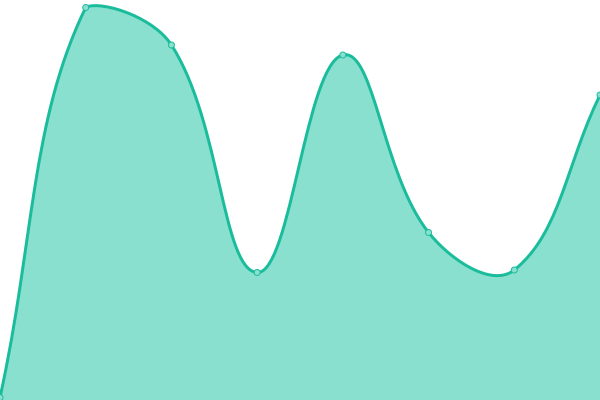
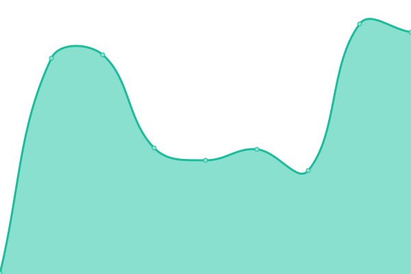
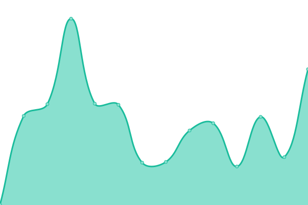

# [📈 Live Status](https://cutiei.github.io/Uptime/): <!--live status--> **🟧 Partial outage**

<!--start: status pages-->
<!-- This summary is generated by Upptime (https://github.com/upptime/upptime) -->
<!-- Do not edit this manually, your changes will be overwritten -->
<!-- prettier-ignore -->
| URL | Status | History | Response Time | Uptime |
| --- | ------ | ------- | ------------- | ------ |
|  [谷歌Google（本监测的稳定性）](https://www.google.com) | 🟩 Up | [google.yml](https://github.com/Cutiei/Uptime/commits/HEAD/history/google.yml) | 

 96ms
     
 | 

<a href="https://Cutiei.github.io/Uptime/history/google">100.00%</a>
    

|  [Fire一104.128.189.11](http://104.128.189.11:42176/) | 🟩 Up | [fire-104-128-189-11.yml](https://github.com/Cutiei/Uptime/commits/HEAD/history/fire-104-128-189-11.yml) | 

 90ms
     
 | 

<a href="https://Cutiei.github.io/Uptime/history/fire-104-128-189-11">100.00%</a>
    

|  [网站一89.117.94.99](http://89.117.94.99/) | 🟥 Down | [89-117-94-99.yml](https://github.com/Cutiei/Uptime/commits/HEAD/history/89-117-94-99.yml) | 

 1533ms
     
 | 

<a href="https://Cutiei.github.io/Uptime/history/89-117-94-99">42.61%</a>
    

|  [备份二88.99.163.99:51968](http://88.99.163.99:51968/) | 🟩 Up | [88-99-163-99-51968.yml](https://github.com/Cutiei/Uptime/commits/HEAD/history/88-99-163-99-51968.yml) | 

 282ms
     
 | 

<a href="https://Cutiei.github.io/Uptime/history/88-99-163-99-51968">99.65%</a>
    

|  [容器一116.202.49.57:50057](http://116.202.49.57:50057/) | 🟩 Up | [116-202-49-57-50057.yml](https://github.com/Cutiei/Uptime/commits/HEAD/history/116-202-49-57-50057.yml) | 

 251ms
     
 | 

<a href="https://Cutiei.github.io/Uptime/history/116-202-49-57-50057">100.00%</a>
    

|  [阿里一106.15.126.131:24211](http://106.15.126.131:24211/) | 🟩 Up | [106-15-126-131-24211.yml](https://github.com/Cutiei/Uptime/commits/HEAD/history/106-15-126-131-24211.yml) | 

 445ms
     
 | 

<a href="https://Cutiei.github.io/Uptime/history/106-15-126-131-24211">100.00%</a>
    

|  [对象储存一88.99.163.99:51969](http://88.99.163.99:51969/) | 🟩 Up | [88-99-163-99-51969.yml](https://github.com/Cutiei/Uptime/commits/HEAD/history/88-99-163-99-51969.yml) | 

 398ms
     
 | 

<a href="https://Cutiei.github.io/Uptime/history/88-99-163-99-51969">99.27%</a>
    

|  [日程同步一（镜像）106.15.126.131:50501](http://106.15.126.131:50501/) | 🟩 Up | [106-15-126-131-50501.yml](https://github.com/Cutiei/Uptime/commits/HEAD/history/106-15-126-131-50501.yml) | 

 5286ms
     
 | 

<a href="https://Cutiei.github.io/Uptime/history/106-15-126-131-50501">99.59%</a>
    

|  [博客一H-e.top](https://h-e.top/) | 🟩 Up | [h-e-top.yml](https://github.com/Cutiei/Uptime/commits/HEAD/history/h-e-top.yml) | 

 279ms
     
 | 

<a href="https://Cutiei.github.io/Uptime/history/h-e-top">100.00%</a>
    

|  [搜索一So.h-e.top](https://so.h-e.top/) | 🟩 Up | [so-h-e-top.yml](https://github.com/Cutiei/Uptime/commits/HEAD/history/so-h-e-top.yml) | 

 1413ms
     
 | 

<a href="https://Cutiei.github.io/Uptime/history/so-h-e-top">41.69%</a>
    

|  [小说一Www.ycasyy.cn](https://www.ycasyy.cn/) | 🟩 Up | [www-ycasyy-cn.yml](https://github.com/Cutiei/Uptime/commits/HEAD/history/www-ycasyy-cn.yml) | 

 320ms
     
 | 

<a href="https://Cutiei.github.io/Uptime/history/www-ycasyy-cn">57.09%</a>
    

|  [防红一Happy.ez6swh.cn](https://happy.ez6swh.cn/) | 🟩 Up | [happy-ez6swh-cn.yml](https://github.com/Cutiei/Uptime/commits/HEAD/history/happy-ez6swh-cn.yml) | 

 302ms
     
 | 

<a href="https://Cutiei.github.io/Uptime/history/happy-ez6swh-cn">56.77%</a>
    

|  [梗一Inewsi.cn](https://inewsi.cn/) | 🟩 Up | [inewsi-cn.yml](https://github.com/Cutiei/Uptime/commits/HEAD/history/inewsi-cn.yml) | 

 249ms
     
 | 

<a href="https://Cutiei.github.io/Uptime/history/inewsi-cn">100.00%</a>
    

|  [小游戏一Play.h-e.top](https://play.h-e.top/) | 🟩 Up | [play-h-e-top.yml](https://github.com/Cutiei/Uptime/commits/HEAD/history/play-h-e-top.yml) | 

 172ms
     
 | 

<a href="https://Cutiei.github.io/Uptime/history/play-h-e-top">100.00%</a>
    

|  [公益接口一Api.h-e.top](https://api.h-e.top/) | 🟩 Up | [api-h-e-top.yml](https://github.com/Cutiei/Uptime/commits/HEAD/history/api-h-e-top.yml) | 

 433ms
     
 | 

<a href="https://Cutiei.github.io/Uptime/history/api-h-e-top">56.77%</a>
    

|  [我的世界服务器一Mc.2b2t.cyou](https://mc.2b2t.cyou/) | 🟩 Up | [mc-2b2t-cyou.yml](https://github.com/Cutiei/Uptime/commits/HEAD/history/mc-2b2t-cyou.yml) | 

 231ms
     
 | 

<a href="https://Cutiei.github.io/Uptime/history/mc-2b2t-cyou">56.77%</a>
    

|  [统计一mat.5i.gs](https://mat.5i.gs/) | 🟩 Up | [mat-5i-gs.yml](https://github.com/Cutiei/Uptime/commits/HEAD/history/mat-5i-gs.yml) | 

 1005ms
     
 | 

<a href="https://Cutiei.github.io/Uptime/history/mat-5i-gs">56.77%</a>
    

|  [联邦宇宙一s.5i.gs](https://s.5i.gs/) | 🟩 Up | [s-5i-gs.yml](https://github.com/Cutiei/Uptime/commits/HEAD/history/s-5i-gs.yml) | 

 195ms
     
 | 

<a href="https://Cutiei.github.io/Uptime/history/s-5i-gs">100.00%</a>
    

|  [博客二iviaja.com](https://iviaja.com/) | 🟩 Up | [iviaja-com.yml](https://github.com/Cutiei/Uptime/commits/HEAD/history/iviaja-com.yml) | 

 1540ms
     
 | 

<a href="https://Cutiei.github.io/Uptime/history/iviaja-com">100.00%</a>
    

|  [导航一nav.5i.gs](https://nav.5i.gs) | 🟥 Down | [nav-5i-gs.yml](https://github.com/Cutiei/Uptime/commits/HEAD/history/nav-5i-gs.yml) | 

 722ms
     
 | 

<a href="https://Cutiei.github.io/Uptime/history/nav-5i-gs">38.41%</a>
    

|  [GIT一git.5i.gs](https://git.5i.gs/) | 🟩 Up | [git-git-5i-gs.yml](https://github.com/Cutiei/Uptime/commits/HEAD/history/git-git-5i-gs.yml) | 

 10590ms
     
 | 

<a href="https://Cutiei.github.io/Uptime/history/git-git-5i-gs">15.35%</a>
    

|  [网盘一ifs.5i.gs](https://ifs.5i.gs/) | 🟥 Down | [ifs-5i-gs.yml](https://github.com/Cutiei/Uptime/commits/HEAD/history/ifs-5i-gs.yml) | 

 844ms
     
 | 

<a href="https://Cutiei.github.io/Uptime/history/ifs-5i-gs">16.61%</a>
    

|  [必应一bing.5i.gs](https://bing.5i.gs/#dialog=%22%22) | 🟥 Down | [bing-5i-gs.yml](https://github.com/Cutiei/Uptime/commits/HEAD/history/bing-5i-gs.yml) | 

 1068ms
     
 | 

<a href="https://Cutiei.github.io/Uptime/history/bing-5i-gs">10.53%</a>
    

|  [笔记一note.5i.gs](https://note.5i.gs/#) | 🟥 Down | [note-5i-gs.yml](https://github.com/Cutiei/Uptime/commits/HEAD/history/note-5i-gs.yml) | 

 763ms
     
 | 

<a href="https://Cutiei.github.io/Uptime/history/note-5i-gs">27.19%</a>
    

|  [短链一yourls.5i.gs](https://yourls.5i.gs/) | 🟩 Up | [yourls-5i-gs.yml](https://github.com/Cutiei/Uptime/commits/HEAD/history/yourls-5i-gs.yml) | 

 153ms
     
 | 

<a href="https://Cutiei.github.io/Uptime/history/yourls-5i-gs">99.73%</a>
    

|  [图床一img.5i.gs](https://img.5i.gs/) | 🟥 Down | [img-5i-gs.yml](https://github.com/Cutiei/Uptime/commits/HEAD/history/img-5i-gs.yml) | 

 800ms
     
 | 

<a href="https://Cutiei.github.io/Uptime/history/img-5i-gs">30.97%</a>
    

|  [图床一（镜像）img.somlife.ru](https://img.somlife.ru/) | 🟥 Down | [img-somlife-ru.yml](https://github.com/Cutiei/Uptime/commits/HEAD/history/img-somlife-ru.yml) | 

 10079ms
     
 | 

<a href="https://Cutiei.github.io/Uptime/history/img-somlife-ru">10.30%</a>
    

|  [网页部作业一（镜像）chinn.org](http://xn--vhq83ak66hwyoeui.chinn.org) | 🟩 Up | [chinn-org.yml](https://github.com/Cutiei/Uptime/commits/HEAD/history/chinn-org.yml) | 

 437ms
     
 | 

<a href="https://Cutiei.github.io/Uptime/history/chinn-org">99.73%</a>
    

|  [网页部作业一（镜像）biring.id](http://xn--vhq83ak66hwyoeui.biring.id) | 🟩 Up | [biring-id.yml](https://github.com/Cutiei/Uptime/commits/HEAD/history/biring-id.yml) | 

 174ms
     
 | 

<a href="https://Cutiei.github.io/Uptime/history/biring-id">99.73%</a>
    

|  [网页部作业一（镜像）absl.ro](http://xn--vhq83ak66hwyoeui.absl.ro) | 🟩 Up | [absl-ro.yml](https://github.com/Cutiei/Uptime/commits/HEAD/history/absl-ro.yml) | 

 241ms
     
 | 

<a href="https://Cutiei.github.io/Uptime/history/absl-ro">99.73%</a>
    

|  [网页部作业一（镜像）star.is](http://xn--vhq83ak66hwyoeui.star.is) | 🟩 Up | [star-is.yml](https://github.com/Cutiei/Uptime/commits/HEAD/history/star-is.yml) | 

 429ms
     
 | 

<a href="https://Cutiei.github.io/Uptime/history/star-is">99.73%</a>
    

|  [网页部作业一（镜像）corex.se](http://xn--vhq83ak66hwyoeui.corex.se) | 🟩 Up | [corex-se.yml](https://github.com/Cutiei/Uptime/commits/HEAD/history/corex-se.yml) | 

 278ms
     
 | 

<a href="https://Cutiei.github.io/Uptime/history/corex-se">99.73%</a>
    

|  [笔记一（镜像）n.i-mind.cl](http://n.i-mind.cl/) | 🟥 Down | [n-i-mind-cl.yml](https://github.com/Cutiei/Uptime/commits/HEAD/history/n-i-mind-cl.yml) | 

 783ms
     
 | 

<a href="https://Cutiei.github.io/Uptime/history/n-i-mind-cl">36.89%</a>
    

|  [必应一（镜像）bingo.0x.no](https://bingo.0x.no/) | 🟩 Up | [bingo-0x-no.yml](https://github.com/Cutiei/Uptime/commits/HEAD/history/bingo-0x-no.yml) | 

 3825ms
     
 | 

<a href="https://Cutiei.github.io/Uptime/history/bingo-0x-no">80.94%</a>
    

|  [导航一（镜像）nav.iiiii.info](https://nav.iiiii.info/) | 🟥 Down | [nav-iiiii-info.yml](https://github.com/Cutiei/Uptime/commits/HEAD/history/nav-iiiii-info.yml) | 

 841ms
     
 | 

<a href="https://Cutiei.github.io/Uptime/history/nav-iiiii-info">23.41%</a>
    

|  [导航一（镜像）nav.k.vu](https://nav.k.vu/) | 🟩 Up | [nav-k-vu.yml](https://github.com/Cutiei/Uptime/commits/HEAD/history/nav-k-vu.yml) | 

 1062ms
     
 | 

<a href="https://Cutiei.github.io/Uptime/history/nav-k-vu">99.66%</a>
    

|  [GIT一（镜像）git.hs.vc](https://git.hs.vc/) | 🟥 Down | [git-git-hs-vc.yml](https://github.com/Cutiei/Uptime/commits/HEAD/history/git-git-hs-vc.yml) | 

 2043ms
     
 | 

<a href="https://Cutiei.github.io/Uptime/history/git-git-hs-vc">9.58%</a>
    

|  [StaticJs一（镜像）trac.beclicked.com](https://trac.beclicked.com/) | 🟥 Down | [static-js-trac-beclicked-com.yml](https://github.com/Cutiei/Uptime/commits/HEAD/history/static-js-trac-beclicked-com.yml) | 

 1053ms
     
 | 

<a href="https://Cutiei.github.io/Uptime/history/static-js-trac-beclicked-com">9.33%</a>
    

|  [搜索一（镜像）searx.ix.tc](https://searx.ix.tc/) | 🟩 Up | [searx-ix-tc.yml](https://github.com/Cutiei/Uptime/commits/HEAD/history/searx-ix-tc.yml) | 

 832ms
     
 | 

<a href="https://Cutiei.github.io/Uptime/history/searx-ix-tc">40.38%</a>
    

|  [小程序一mini2.396pay.cn](https://mini2.396pay.cn/) | 🟩 Up | [mini2-396pay-cn.yml](https://github.com/Cutiei/Uptime/commits/HEAD/history/mini2-396pay-cn.yml) | 

 875ms
     
 | 

<a href="https://Cutiei.github.io/Uptime/history/mini2-396pay-cn">98.57%</a>
    

|  [工具一tool.5i.gs](https://tool.5i.gs/) | 🟥 Down | [tool-5i-gs.yml](https://github.com/Cutiei/Uptime/commits/HEAD/history/tool-5i-gs.yml) | 

 564ms
     
 | 

<a href="https://Cutiei.github.io/Uptime/history/tool-5i-gs">55.12%</a>
    

|  [剪贴板一cut.5i.gs](https://cut.5i.gs/) | 🟥 Down | [cut-5i-gs.yml](https://github.com/Cutiei/Uptime/commits/HEAD/history/cut-5i-gs.yml) | 

 540ms
     
 | 

<a href="https://Cutiei.github.io/Uptime/history/cut-5i-gs">71.46%</a>
    

|  [剪贴板一（镜像）cut.3uu.me](https://cut.3uu.me/) | 🟩 Up | [cut-3uu-me.yml](https://github.com/Cutiei/Uptime/commits/HEAD/history/cut-3uu-me.yml) | 

 4168ms
     
 | 

<a href="https://Cutiei.github.io/Uptime/history/cut-3uu-me">70.03%</a>
    

|  [专用一（镜像）cadence.jroxg.org](https://cadence.jroxg.org/) | 🟩 Up | [cadence-jroxg-org.yml](https://github.com/Cutiei/Uptime/commits/HEAD/history/cadence-jroxg-org.yml) | 

 486ms
     
 | 

<a href="https://Cutiei.github.io/Uptime/history/cadence-jroxg-org">86.98%</a>
    

|  [静态CDN（镜像）106.15.126.131:8443](https://106.15.126.131:8443/) | 🟩 Up | [cdn-106-15-126-131-8443.yml](https://github.com/Cutiei/Uptime/commits/HEAD/history/cdn-106-15-126-131-8443.yml) | 

 1501ms
     
 | 

<a href="https://Cutiei.github.io/Uptime/history/cdn-106-15-126-131-8443">100.00%</a>
    

|  [小雅一res-ya.5i.gs](https://res-ya.5i.gs/) | 🟥 Down | [res-ya-5i-gs.yml](https://github.com/Cutiei/Uptime/commits/HEAD/history/res-ya-5i-gs.yml) | 

 2868ms
     
 | 

<a href="https://Cutiei.github.io/Uptime/history/res-ya-5i-gs">99.98%</a>
    

|  [监测一change.5i.gs](https://change.5i.gs/) | 🟥 Down | [change-5i-gs.yml](https://github.com/Cutiei/Uptime/commits/HEAD/history/change-5i-gs.yml) | 

 1940ms
     
 | 

<a href="https://Cutiei.github.io/Uptime/history/change-5i-gs">99.87%</a>
    

<!--end: status pages-->

[**Visit our status website →**](https://cutiei.github.io/Uptime/)

## 📄 License

- Powered by: [Upptime](https://github.com/upptime/upptime)
- Code: [MIT](./LICENSE) © [Cutiei](https://demo.upptime.js.org)
- Data in the `./history` directory: [Open Database License](https://opendatacommons.org/licenses/odbl/1-0/)
